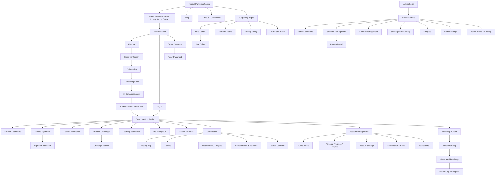

# Algora Website Architecture

This document maps out the architecture of the Algora web platform, categorizing all pages and their functionalities as defined in the project's markdown specifications.

## Graph Architecture

## Page Directory & Functions

### Section 1: Marketing
*   **Pages 1-6 (Home, Visualizer, Learning Paths, Pricing, About, Contact):** Core marketing pages to drive user acquisition.
*   **Page 7 (Blog):** Editorial hub for articles on algorithms, interview prep, and study techniques.
*   **Page 8 (Campus / Universities):** Landing page for educators, bootcamps, and departments to request cohort access and view instructor dashboards.

### Section 2: Authentication
*   **Page 9 (Sign up):** Account creation via Google, GitHub, or email.
*   **Page 10 (Log in):** Returning user sign-in screen.
*   **Page 11 (Forgot password):** Screen to request a secure password reset link.
*   **Page 12 (Reset password):** Form to establish a new password from an email link.
*   **Page 13 (Email verification):** 6-digit code entry to verify a new user's email address.

### Section 3: Onboarding
*   **Page 14 (Learning goals):** Step 1 - Users pick their learning goals and time commitment.
*   **Page 15 (Skill assessment):** Step 2 - Diagnostic quiz assessing existing knowledge to calibrate their path.
*   **Page 16 (Personalized path result):** Step 3 - Custom learning plan generated from goals and assessment.

### Section 4: Learning Product (Core App)
*   **Page 17 (Student dashboard):** Home base after login, showing current progress, next lessons, and daily plan.
*   **Page 18 (Explore algorithms):** Catalog for browsing and filtering all algorithms and data structures.
*   **Page 19 (Algorithm visualizer):** The flagship workspace with a synchronized graph visualizer, code editor, and explanation pane.
*   **Page 20 (Lesson experience):** Step-by-step reading flow with embedded visuals and mini-quizzes.
*   **Page 21 (Practice challenge):** Coding workspace with light-themed editor, test cases, and a submit flow.
*   **Page 22 (Challenge results):** Success screen showing runtime, memory, XP earned, and next steps.
*   **Page 23 (Learning-path detail):** Full curriculum view of a specific path (modules and lessons).
*   **Page 24 (Review queue):** Spaced-repetition flashcards to review learned concepts.
*   **Page 25 (Search / results):** Global search engine for algorithms, lessons, paths, and glossary terms.

### Section 5: Gamification
*   **Page 26 (Mastery map):** Interactive skill tree mapping mastered, in-progress, and locked concepts.
*   **Page 27 (Quests):** Daily, weekly, and special goals for earning XP and streak freezes.
*   **Page 28 (Leaderboard / leagues):** Weekly ranked competition matching students in the same tier (e.g., Bronze to Diamond).
*   **Page 29 (Achievements and rewards):** Unlockable badges grid and an XP reward shop.
*   **Page 30 (Streak calendar):** GitHub-style heatmap showing daily learning activity over the year.

### Section 6: Account
*   **Page 31 (Public profile):** Shareable page showing student identity, level, badges, and activity timeline.
*   **Page 32 (Personal progress / analytics):** Private dashboard tracking XP over time, topic mastery, and weak spots.
*   **Page 33 (Account settings):** Profile information, security (2FA), preferences, and active sessions.
*   **Page 34 (Subscription and billing):** Current active plan, payment methods, and invoice history.
*   **Page 35 (Notifications):** Inbox of recent activity (badges, streaks) and channel preferences.

### Section 7: Supporting Pages
*   **Page 36 (Help center):** Searchable landing page for support categories and popular articles.
*   **Page 37 (Help article):** Documentation layout with sidebar navigation and a main reading pane.
*   **Page 38 (Platform status):** Real-time service health, overall uptime, and incident history.
*   **Page 39 (Privacy policy):** Legal documentation outlining data usage with a sticky table of contents.
*   **Page 40 (Terms of service):** Legal documentation detailing acceptable use policies.

### Section 8: Roadmap Builder
*   **Page 41 (Roadmap Setup):** Input form to define learning goals (e.g., FAANG Interviews) and duration (e.g., 90 days).
*   **Page 42 (Generated Roadmap):** Customized, phase-based syllabus mapping out daily lessons and practices.
*   **Page 43 (Daily Study Workspace):** Focused execution UI presenting the day's checklist alongside an active coding problem or lesson.

### Admin Suite (Internal)
*   **Page A1 (Admin login):** Restricted, security-forward sign-in page for staff.
*   **Page A2 (Admin dashboard):** Operational pulse with KPIs, active users, system health, and live activity.
*   **Page A3 (Students):** Database table for filtering, searching, and managing all students.
*   **Page A4 (Student detail):** Deep-dive profile for support, showing learning progress, device sessions, and billing.
*   **Page A5 (Content management):** Editor console to create, update, and manage lessons, algorithms, and paths.
*   **Page A6 (Subscriptions & billing):** Financial dashboard tracking MRR, active subscriptions, and churn.
*   **Page A7 (Analytics):** Engagement metrics, signup funnels, and retention cohort heatmaps.
*   **Page A8 (Admin settings):** Team member management, roles/permissions, and platform configuration.
*   **Page A9 (Admin profile & security):** Individual staff profile, session management, and logged action history.
